# Jekyll Blog System - Comprehensive Design Document

## Table of Contents

1. [System Overview](#system-overview)
2. [Architecture Diagrams](#architecture-diagrams)
3. [GitHub Integration](#github-integration)
4. [Jekyll Processing Flow](#jekyll-processing-flow)
5. [Folder Structure](#folder-structure)
6. [Content Management](#content-management)
7. [Build and Deployment](#build-and-deployment)
8. [User Journey](#user-journey)
9. [Technical Specifications](#technical-specifications)

---

## System Overview

This Jekyll-based blog system is a static site generator that transforms Markdown content into a responsive, SEO-optimized website. The system leverages GitHub Pages for hosting and automatic deployment, creating a seamless content management workflow.

### Key Components

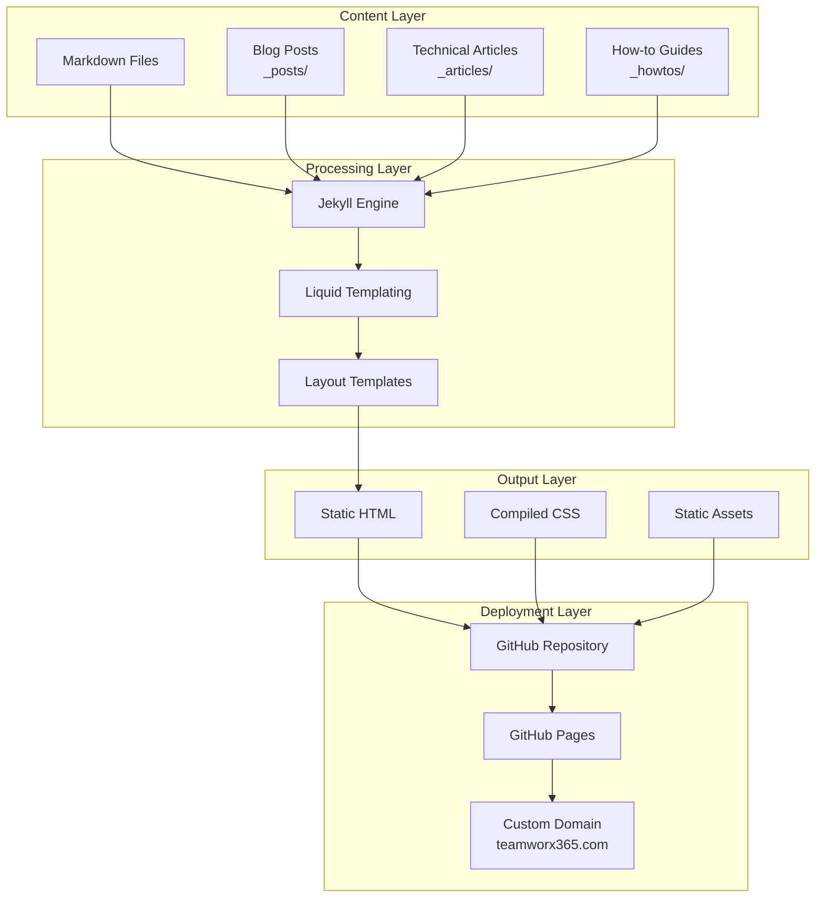

---

## Architecture Diagrams

### System Architecture Overview

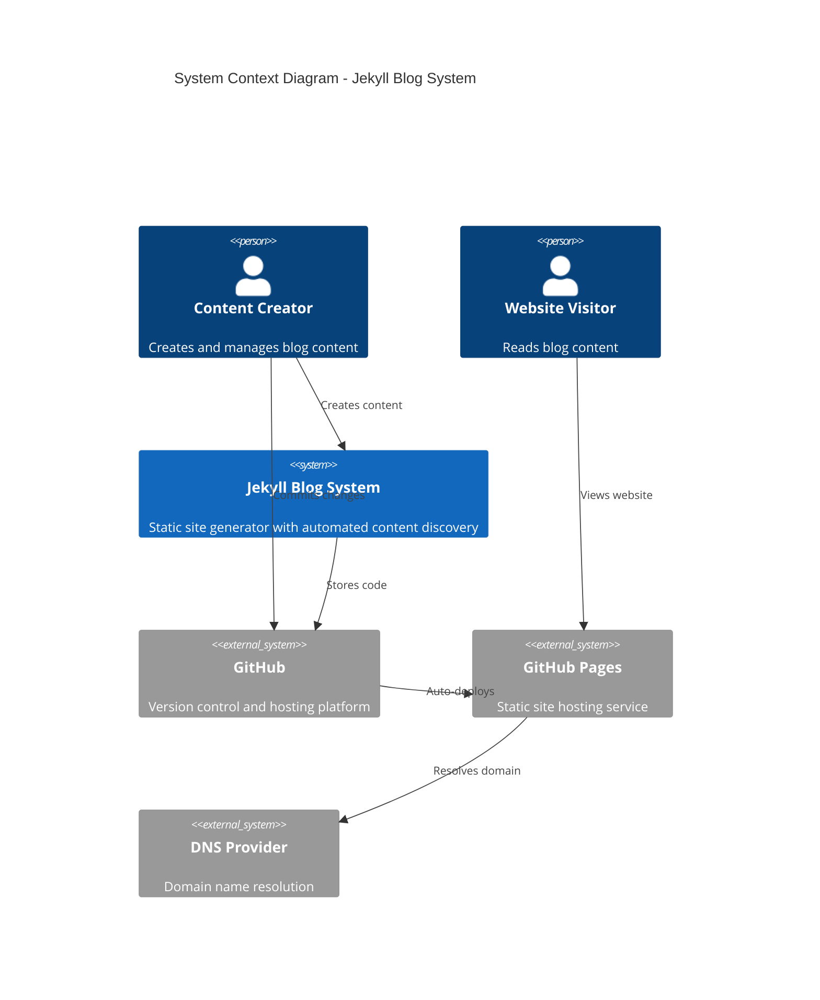

### Container Diagram

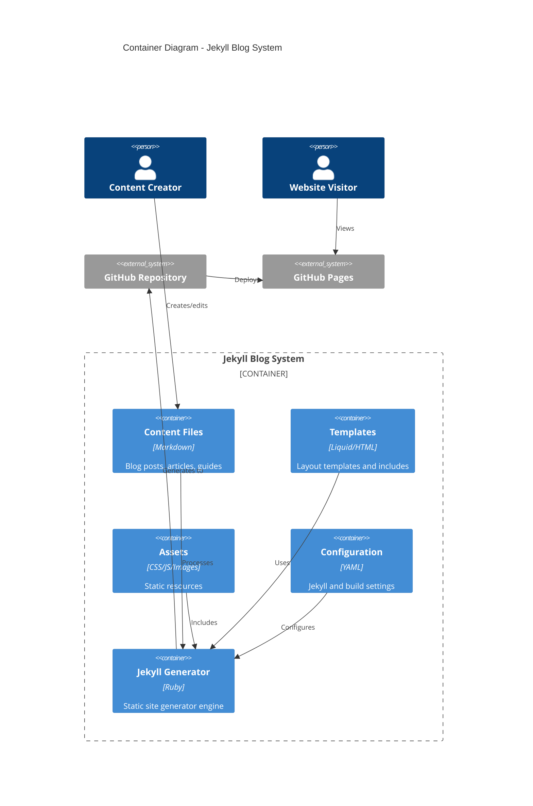

### Component Diagram - Jekyll Processing

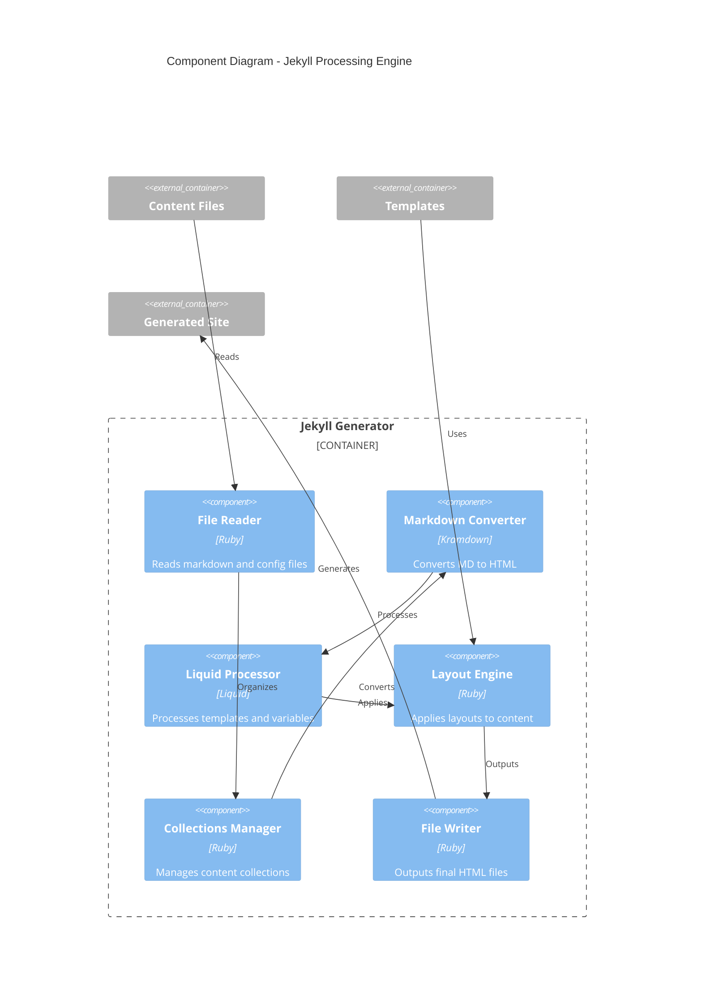

---

## GitHub Integration

### Repository Structure and Git Flow

```mermaid
gitgraph
    commit id: "Initial Jekyll setup"
    commit id: "Add content collections"
    commit id: "Implement responsive design"
    branch feature/blog-enhancement
    commit id: "Add blog functionality"
    commit id: "Create navigation menu"
    checkout main
    merge feature/blog-enhancement
    commit id: "Fix index.html generation"
    commit id: "Add blog link to navigation"
    commit id: "Clean up unused files"
    commit id: "Add comprehensive documentation"
```

### GitHub Pages Deployment Flow

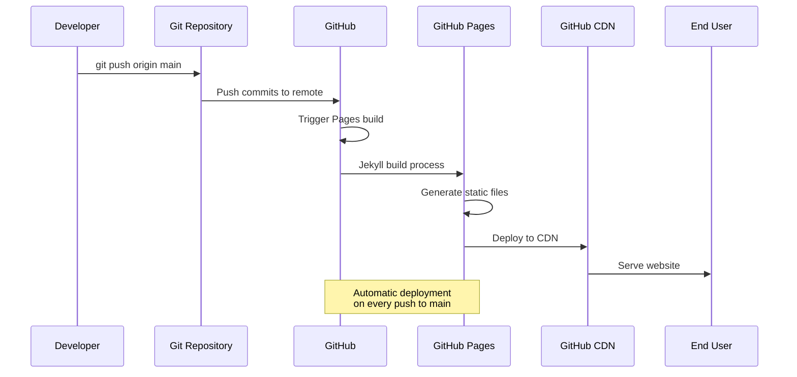

### File Change Detection

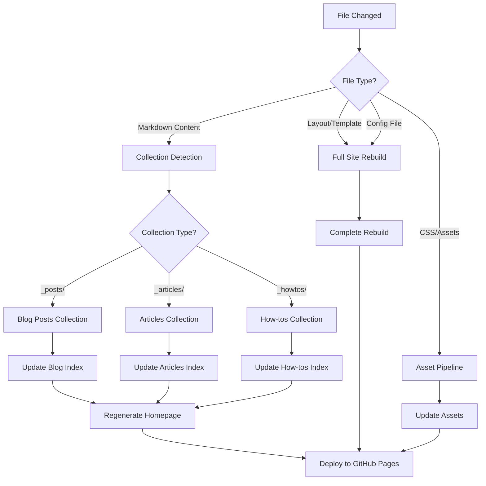

---

## Jekyll Processing Flow

### Build Process Overview

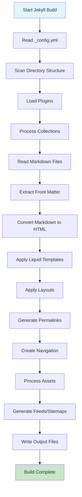

### Content Processing Pipeline

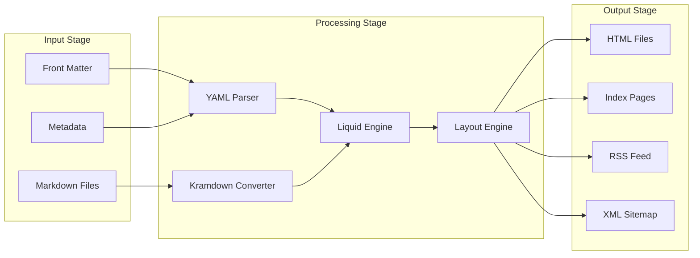

### Collection Processing Detail

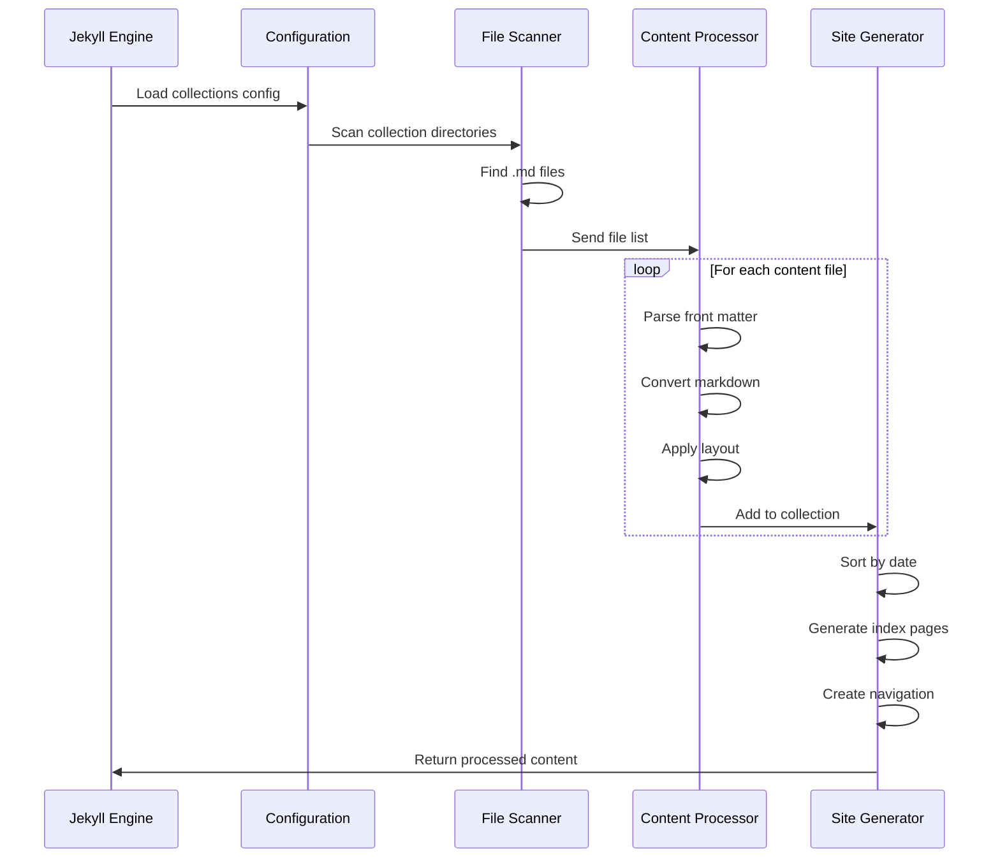

---

## Folder Structure

### Complete Directory Tree

```mermaid
graph TD
    ROOT["/"] --> CONFIG["_config.yml"]
    ROOT --> GEMFILE["Gemfile"]
    ROOT --> INDEX["index.html"]
    ROOT --> ABOUT["about.md"]
    ROOT --> BLOG["blog.md"]
    ROOT --> ARTICLES["articles.md"]
    ROOT --> HOWTOS["howtos.md"]
    ROOT --> CNAME["CNAME"]
    
    ROOT --> LAYOUTS["_layouts/"]
    LAYOUTS --> DEFAULT["default.html"]
    LAYOUTS --> POST["post.html"]
    
    ROOT --> POSTS["_posts/"]
    POSTS --> POST1["2025-07-20-sample-post.md"]
    POSTS --> POST2["2025-01-20-test-markdown.md"]
    POSTS --> POST3["2025-07-20-testing-auto-discovery.md"]
    
    ROOT --> ARTICLESCOL["_articles/"]
    ARTICLESCOL --> ART1["sample-article.md"]
    ARTICLESCOL --> ART2["setup-docker-development.md"]
    ARTICLESCOL --> ART3["jekyll-collections-vs-posts.md"]
    ARTICLESCOL --> ARTINDEX["index.html"]
    
    ROOT --> HOWTOSCOL["_howtos/"]
    HOWTOSCOL --> HOW1["sample-howto.md"]
    HOWTOSCOL --> HOW2["deploy-github-pages.md"]
    HOWTOSCOL --> HOW3["quick-reference-adding-content.md"]
    HOWTOSCOL --> HOWINDEX["index.html"]
    
    ROOT --> ASSETS["assets/"]
    ASSETS --> CSS["css/"]
    CSS --> MAIN["main.css"]
    
    ROOT --> SITE["_site/"]
    SITE --> GENERATED["Generated HTML files"]
    
    style ROOT fill:#e3f2fd
    style LAYOUTS fill:#fff3e0
    style POSTS fill:#f3e5f5
    style ARTICLESCOL fill:#e8f5e8
    style HOWTOSCOL fill:#fff8e1
    style ASSETS fill:#fce4ec
    style SITE fill:#f1f8e9
```

### File Organization Strategy

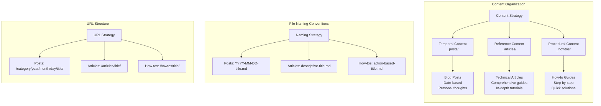

---

## Content Management

### Content Lifecycle

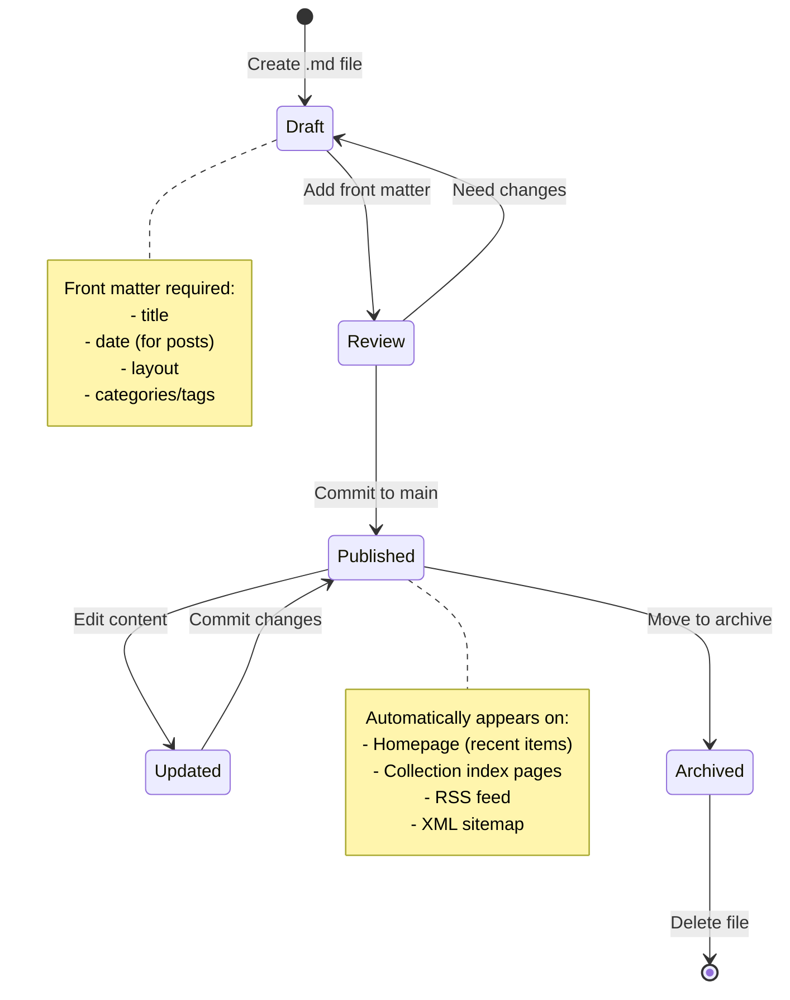

### Content Discovery Flow

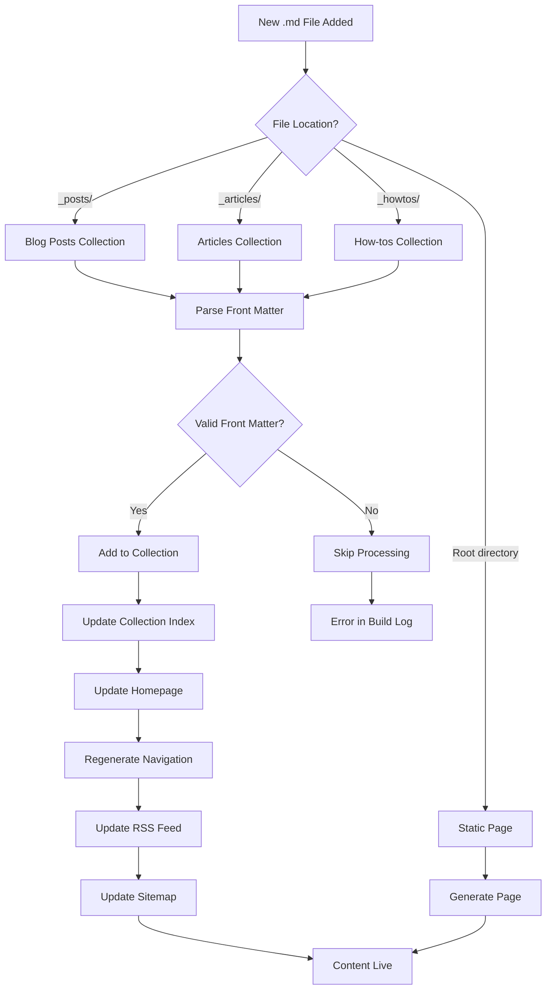

### Metadata Schema

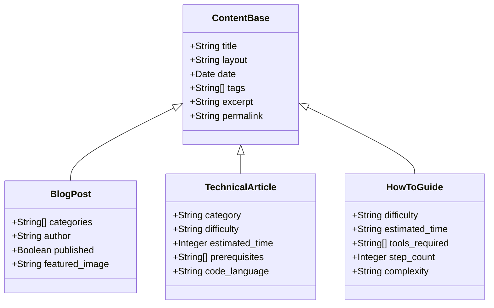

---

## Build and Deployment

### CI/CD Pipeline

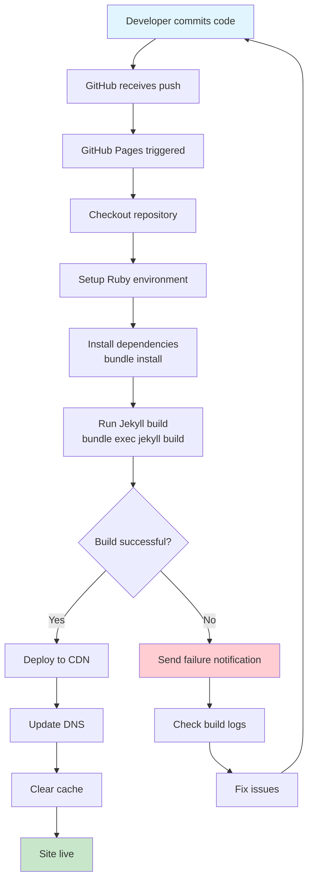

### Build Environment

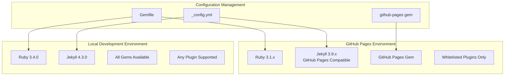

### Performance Optimization

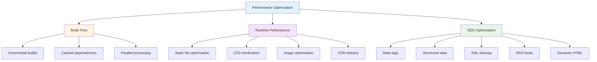

---

## User Journey

### Visitor Experience Flow

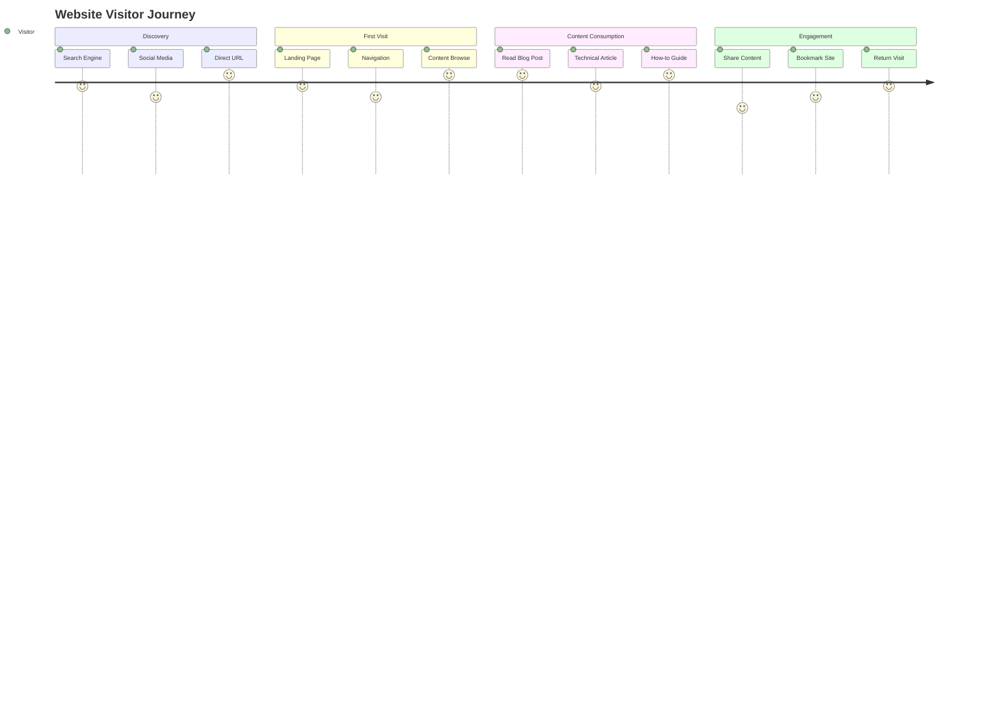

### Content Creator Workflow

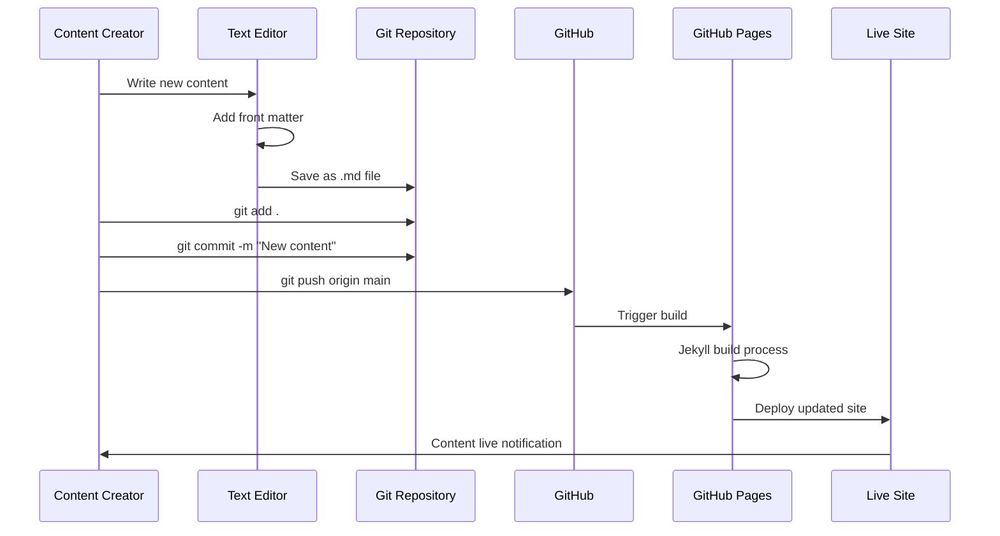

### Navigation Architecture

```mermaid
graph TD
    HOME[Homepage<br/>index.html] --> BLOG[Blog<br/>/blog/]
    HOME --> ARTICLES[Articles<br/>/articles/]
    HOME --> HOWTOS[How-tos<br/>/howtos/]
    HOME --> ABOUT[About<br/>/about/]
    
    BLOG --> BLOG_POST[Individual Post<br/>/category/year/month/day/title/]
    ARTICLES --> ARTICLE[Individual Article<br/>/articles/title/]
    HOWTOS --> HOWTO[Individual Guide<br/>/howtos/title/]
    
    BLOG_POST --> RELATED[Related Posts]
    ARTICLE --> RELATED_ARTICLES[Related Articles]
    HOWTO --> RELATED_GUIDES[Related Guides]
    
    RELATED --> HOME
    RELATED_ARTICLES --> HOME
    RELATED_GUIDES --> HOME
    
    style HOME fill:#e3f2fd
    style BLOG fill:#f3e5f5
    style ARTICLES fill:#e8f5e8
    style HOWTOS fill:#fff8e1
    style ABOUT fill:#fce4ec
```

---

## Technical Specifications

### Technology Stack Details

```mermaid
graph TB
    subgraph "Frontend Technologies"
        HTML5[HTML5<br/>Semantic markup]
        CSS3[CSS3<br/>Grid + Flexbox]
        JS[Vanilla JavaScript<br/>Progressive enhancement]
    end
    
    subgraph "Build Tools"
        JEKYLL[Jekyll 4.3.0<br/>Static site generator]
        LIQUID[Liquid<br/>Templating engine]
        KRAMDOWN[Kramdown<br/>Markdown processor]
        ROUGE[Rouge<br/>Syntax highlighter]
    end
    
    subgraph "Development Environment"
        RUBY[Ruby 3.4.0<br/>Runtime environment]
        BUNDLER[Bundler<br/>Dependency management]
        GIT[Git<br/>Version control]
    end
    
    subgraph "Hosting & Deployment"
        GITHUB[GitHub<br/>Code repository]
        PAGES[GitHub Pages<br/>Static hosting]
        CDN[GitHub CDN<br/>Global distribution]
        DNS[Custom DNS<br/>teamworx365.com]
    end
    
    subgraph "SEO & Analytics"
        SEO_TAG[Jekyll SEO Tag<br/>Meta optimization]
        SITEMAP[XML Sitemap<br/>Search indexing]
        FEED[RSS Feed<br/>Content syndication]
        SCHEMA[Schema.org<br/>Structured data]
    end
```

### Database Schema (Jekyll Collections)

```mermaid
erDiagram
    SITE ||--o{ POSTS : contains
    SITE ||--o{ ARTICLES : contains
    SITE ||--o{ HOWTOS : contains
    SITE ||--o{ PAGES : contains
    
    POSTS {
        string title
        date date
        string[] categories
        string[] tags
        string author
        string layout
        text content
        string permalink
    }
    
    ARTICLES {
        string title
        date date
        string category
        string difficulty
        string[] tags
        string layout
        text content
        string permalink
        int estimated_time
    }
    
    HOWTOS {
        string title
        date date
        string difficulty
        string estimated_time
        string[] tools_required
        string[] tags
        string layout
        text content
        string permalink
    }
    
    PAGES {
        string title
        string layout
        string permalink
        text content
        boolean published
    }
```

### Security Considerations

```mermaid
graph TD
    A[Security Measures] --> B[Static Site Benefits]
    A --> C[GitHub Security]
    A --> D[Content Security]
    
    B --> B1[No database vulnerabilities]
    B --> B2[No server-side processing]
    B --> B3[Reduced attack surface]
    
    C --> C1[Two-factor authentication]
    C --> C2[Branch protection rules]
    C --> C3[Dependency scanning]
    C --> C4[Secret scanning]
    
    D --> D1[Content sanitization]
    D --> D2[Safe markdown processing]
    D --> D3[XSS prevention]
    D --> D4[HTTPS enforcement]
    
    style A fill:#e3f2fd
    style B fill:#e8f5e8
    style C fill:#fff3e0
    style D fill:#f3e5f5
```

### Performance Metrics

```mermaid
graph LR
    subgraph "Core Web Vitals"
        LCP[Largest Contentful Paint<br/>< 2.5s]
        FID[First Input Delay<br/>< 100ms]
        CLS[Cumulative Layout Shift<br/>< 0.1]
    end
    
    subgraph "Additional Metrics"
        FCP[First Contentful Paint<br/>< 1.8s]
        TTI[Time to Interactive<br/>< 3.8s]
        TBT[Total Blocking Time<br/>< 200ms]
    end
    
    subgraph "Network Performance"
        SIZE[Total Page Size<br/>< 500KB]
        REQUESTS[HTTP Requests<br/>< 20]
        CACHE[Cache Hit Rate<br/>> 90%]
    end
    
    style LCP fill:#c8e6c9
    style FID fill:#c8e6c9
    style CLS fill:#c8e6c9
```

---

## Conclusion

This comprehensive design document outlines the complete architecture and implementation of the Jekyll blog system. The system provides:

- **Scalable Content Management**: Through Jekyll collections and automated discovery
- **Modern Development Workflow**: Git-based content management with automatic deployment
- **Performance Optimization**: Static site generation with CDN delivery
- **SEO Excellence**: Built-in optimization features and structured data
- **Maintainability**: Clean separation of content, presentation, and configuration

The system is designed to grow with content needs while maintaining simplicity and performance.
