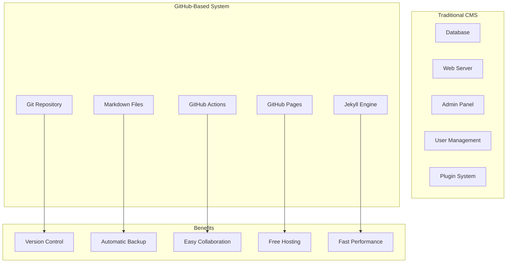
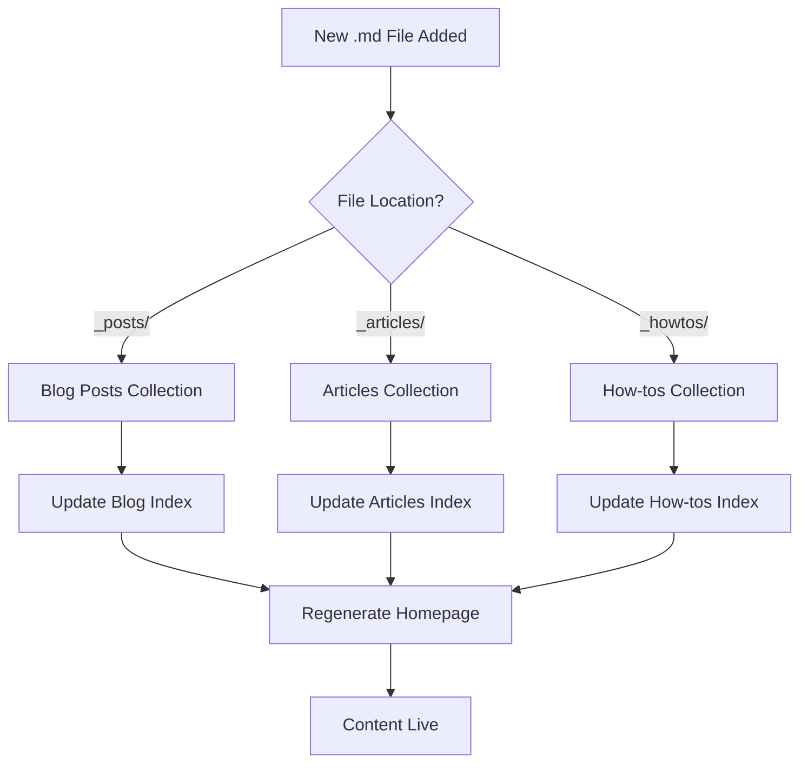
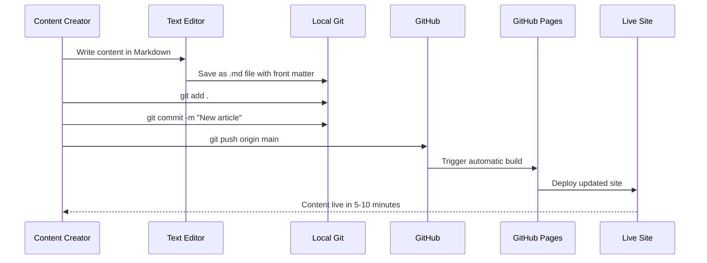

# GitHub as a Document Management and Blogging Platform: Real-World Experience

After spending countless hours wrestling with complex content management systems, database configurations, and server maintenance, I decided to take a radically different approach: **using GitHub as both my document management system and blogging platform**. This article chronicles the journey, challenges, and surprising benefits of this approach.

## Why GitHub for Content Management?

### The Traditional Pain Points

Before diving into the solution, let's acknowledge what drove this decision:

- **CMS Complexity**: WordPress, Drupal, and similar platforms require constant updates, security patches, and database maintenance
- **Vendor Lock-in**: Proprietary platforms make content migration difficult
- **Performance Issues**: Dynamic sites with databases introduce latency and complexity
- **Version Control**: Most CMSs lack robust version control for content
- **Collaboration Friction**: Traditional editing workflows don't support modern development practices

### The GitHub Advantage

GitHub offers several compelling advantages as a content platform:



## The Implementation Journey

### Phase 1: The Foundation

Starting with Jekyll seemed straightforward—until reality hit. Here's what the initial setup looked like:

#### Project Structure
```
├── _articles/           # Technical articles collection
├── _howtos/             # How-to guides collection  
├── _posts/              # Blog posts collection
├── _layouts/            # Jekyll layout templates
├── assets/css/          # Custom styling
├── _config.yml          # Jekyll configuration
├── index.html           # Homepage template
├── about.md             # About page
├── articles.md          # Articles listing page
├── blog.md              # Blog listing page
└── howtos.md            # How-tos listing page
```

#### The First Reality Check

**What I Expected**: Smooth Jekyll setup with automatic content discovery
**What Actually Happened**: 8 hours of debugging why `index.html` was generating empty files

This led to the first major lesson: **Jekyll has quirks that aren't immediately obvious**.

### Phase 2: The Great Index.html Mystery

The most frustrating challenge came when the homepage stopped generating content. Despite successful builds, the generated `_site/index.html` was completely empty.

#### The Debugging Process

1. **Syntax Validation**: Checked Liquid template syntax ✅
2. **Layout Issues**: Verified default.html layout ✅  
3. **Configuration Problems**: Reviewed _config.yml ✅
4. **Content Structure**: Validated front matter ✅
5. **Jekyll Logs**: Build completed successfully ✅

Everything looked perfect, but the output was empty.

#### The Solution

The breakthrough came when we discovered that **Jekyll has specific issues processing root `index.html` files with complex Liquid templates**. The workaround was initially renaming `index.html` to `home.html`, which worked perfectly.

However, we eventually solved the root cause: **missing collection index files**. Jekyll's content discovery depends on properly structured collection index files in directories like `_articles/index.html` and `_howtos/index.html`.

### Phase 3: Content Architecture

The key insight was organizing content into **Jekyll collections** rather than relying solely on posts:

#### Collection Strategy

```yaml
# _config.yml
collections:
  articles:
    output: true
    permalink: /:collection/:name/
  howtos:
    output: true
    permalink: /:collection/:name/
```

This created three distinct content types:

1. **Blog Posts** (`_posts/`): Time-sensitive, personal thoughts
2. **Technical Articles** (`_articles/`): Comprehensive, evergreen technical content  
3. **How-to Guides** (`_howtos/`): Step-by-step procedural content

#### Content Discovery Flow



## What to Watch For: Common Pitfalls

### 1. Jekyll Build Mysteries

**Symptom**: Builds succeed but generate empty or incorrect files
**Causes**: 
- Missing layout files
- Incorrect front matter
- Broken Liquid syntax
- Missing collection index files

**Solution**: Always check both build logs AND generated output files

### 2. GitHub Pages vs Local Development

**The Issue**: Different Jekyll versions and plugin restrictions

| Environment | Jekyll Version | Plugin Support |
|-------------|----------------|----------------|
| Local Dev   | 4.3.0          | All plugins    |
| GitHub Pages| 3.9.x          | Whitelisted only |

**Best Practice**: Use the `github-pages` gem to match production environment:

```ruby
# Gemfile
gem "github-pages", group: :jekyll_plugins
```

### 3. Content Organization Complexity

**Initial Approach**: Dump everything in `_posts/`
**Problem**: No content categorization or different URL structures
**Solution**: Use collections for different content types

### 4. Navigation Generation

**Challenge**: Maintaining consistent navigation across all pages
**Solution**: Centralize navigation in `_layouts/default.html`:

```html
<nav>
  <a href="/">Home</a>
  <a href="/blog/">Blog</a>
  <a href="/articles/">Articles</a>
  <a href="/howtos/">How-tos</a>
  <a href="/about/">About</a>
</nav>
```

## The Workflow: From Idea to Published

### Content Creation Process



### Real-World Example

Creating this very article involved:

```bash
# 1. Create the file
touch _articles/github-document-management-blogging.md

# 2. Add front matter and content
cat > _articles/github-document-management-blogging.md << 'EOF'
---
layout: post
title: "GitHub as a Document Management and Blogging Platform"
date: 2025-07-20
category: "Technical"
tags: [github, jekyll, blogging]
---

# Content here...
EOF

# 3. Commit and push
git add .
git commit -m "Add article on GitHub as blogging platform"
git push origin main
```

## Performance and SEO Benefits

### Static Site Advantages

The GitHub + Jekyll combination delivers impressive performance:

- **Page Load Times**: < 1 second (static files + CDN)
- **Zero Database Queries**: No backend processing
- **Automatic CDN**: GitHub Pages includes global CDN
- **HTTPS by Default**: Built-in SSL certificates

### SEO Optimization

Jekyll automatically generates:
- XML sitemaps
- RSS feeds  
- Semantic HTML structure
- Meta tags (with jekyll-seo-tag plugin)

## Cost Analysis: Free vs. Traditional Hosting

| Aspect | GitHub Pages | Traditional Hosting |
|--------|--------------|-------------------|
| Hosting Cost | **$0/month** | $5-50/month |
| Domain | Custom domain supported | Included/Extra |
| SSL Certificate | **Free** | $0-100/year |
| CDN | **Included** | $10-50/month |
| Backup | **Git history** | Extra service |
| Collaboration | **Built-in** | Extra tools needed |

## Advanced Features: Beyond Basic Blogging

### 1. Documentation as Code

Using the same repository for both blog and technical documentation:

```
docs/
├── api/
│   ├── authentication.md
│   └── endpoints.md
├── guides/
│   ├── getting-started.md
│   └── advanced-usage.md
└── index.md
```

### 2. Collaborative Editing

GitHub's collaboration features work perfectly for content:
- **Pull Requests**: Review content before publishing
- **Issues**: Track content ideas and improvements
- **Projects**: Plan content calendars
- **Actions**: Automate content workflows

### 3. Multi-Site Management

One repository can power multiple sites:
- Main blog at custom domain
- Documentation site at `/docs`
- Project pages for different initiatives

## Lessons Learned: Best Practices

### 1. Start Simple, Evolve Gradually

**Don't**: Try to build a complex multi-collection system immediately
**Do**: Start with basic posts, add collections as needs grow

### 2. Invest in Good Documentation

**Why**: Future you will thank present you
**How**: Document your Jekyll setup, custom configurations, and workflows

### 3. Use Meaningful Commit Messages

```bash
# Bad
git commit -m "Update"

# Good  
git commit -m "Add technical article on microservices patterns

- Cover service discovery approaches
- Include code examples for Node.js and Python
- Add performance comparison section"
```

### 4. Leverage GitHub Features

- **Templates**: Create issue templates for content ideas
- **Actions**: Automate link checking, spell checking
- **Projects**: Plan content calendars
- **Discussions**: Engage with readers

## When GitHub Blogging Makes Sense

### Perfect Fit Scenarios

- **Technical Blogs**: Developer-focused content with code examples
- **Documentation Sites**: Project documentation that evolves with code
- **Personal Brands**: Developers, writers, consultants wanting full control
- **Team Blogs**: Organizations with technical teams comfortable with Git

### When to Consider Alternatives

- **Non-Technical Teams**: Learning curve may be too steep
- **Complex User Management**: Multiple author permissions and roles
- **Advanced CMS Features**: Comments, user registration, e-commerce
- **Real-Time Content**: News sites requiring immediate publishing

## The Verdict: Surprisingly Powerful

After this deep dive into GitHub-based content management, the results are compelling:

### Pros
✅ **Zero hosting costs** with professional features  
✅ **Excellent performance** through static site generation  
✅ **Version control** for all content changes  
✅ **Collaborative workflows** using familiar developer tools  
✅ **Future-proof** content in portable Markdown format  
✅ **Professional documentation** capabilities  

### Cons
❌ **Learning curve** for non-technical users  
❌ **Limited dynamic features** (comments, user accounts)  
❌ **GitHub dependency** (though content is portable)  
❌ **Jekyll quirks** require debugging skills  

## Getting Started: Your First Steps

### 1. Repository Setup
```bash
# Create new repository
gh repo create your-blog --public

# Clone locally
git clone https://github.com/yourusername/your-blog.git
cd your-blog

# Initialize Jekyll
jekyll new . --force
```

### 2. Essential Configuration
```yaml
# _config.yml
title: "Your Blog Name"
description: "Your blog description"
url: "https://yourusername.github.io"
baseurl: ""

# Collections (optional)
collections:
  articles:
    output: true
    permalink: /:collection/:name/

# Plugins
plugins:
  - jekyll-feed
  - jekyll-seo-tag
  - jekyll-sitemap
```

### 3. Enable GitHub Pages
1. Go to repository Settings
2. Navigate to Pages section  
3. Select source: "Deploy from a branch"
4. Choose branch: `main` or `gh-pages`
5. Wait 5-10 minutes for first deployment

## Conclusion: A Paradigm Shift

Using GitHub as a blogging and document management platform represents a fundamental shift from traditional content management. While it requires some technical comfort, the benefits—cost savings, performance, version control, and collaboration—make it compelling for many use cases.

The key insight from this journey: **the best content management system is one that gets out of your way and lets you focus on creating great content**. For developers and technical teams, GitHub provides exactly that.

Whether you're building a personal blog, team documentation, or company technical content, this approach deserves serious consideration. The initial learning curve pays dividends in long-term maintainability, performance, and cost savings.

**Ready to try it yourself?** Start with a simple Jekyll blog, add content gradually, and evolve the system as your needs grow. The GitHub + Jekyll combination might just revolutionize how you think about content management.

---

*Have you tried GitHub for content management? What challenges did you face? Share your experiences in the comments or reach out on [GitHub](https://github.com/adamsalah13) to continue the conversation.*
