# Jekyll Blog Content Management System - Design Document

## Table of Contents

1. [System Overview](#system-overview)
2. [Architecture Diagram](#architecture-diagram)
3. [Content Types & Structure](#content-types--structure)
4. [File Organization](#file-organization)
5. [Content Workflow](#content-workflow)
6. [URL Structure](#url-structure)
7. [Step-by-Step Content Creation](#step-by-step-content-creation)
8. [Deployment Process](#deployment-process)
9. [Maintenance & Best Practices](#maintenance--best-practices)

## System Overview

This Jekyll blog system is designed for technical content creators who need to organize different types of content efficiently. The system supports four primary content types with distinct purposes and workflows.

### Key Features

- **Multi-content architecture**: Blogs, Articles, How-tos, and Projects
- **Automated content discovery**: New files are automatically processed
- **Responsive design**: Works on all devices
- **SEO optimized**: Proper meta tags and semantic structure
- **GitHub Pages compatible**: Zero-configuration deployment

### Target Users

- Technical bloggers
- Developer advocates
- Documentation writers
- Portfolio creators

## Architecture Diagram

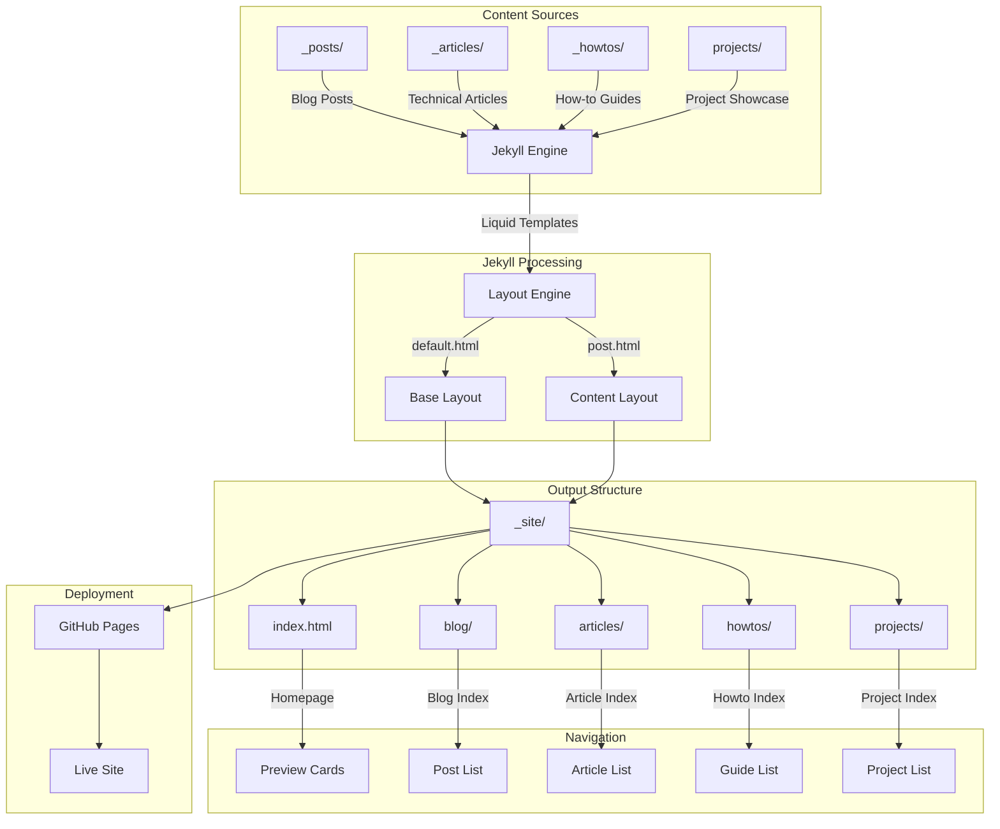

## Content Types & Structure

### Content Type Matrix

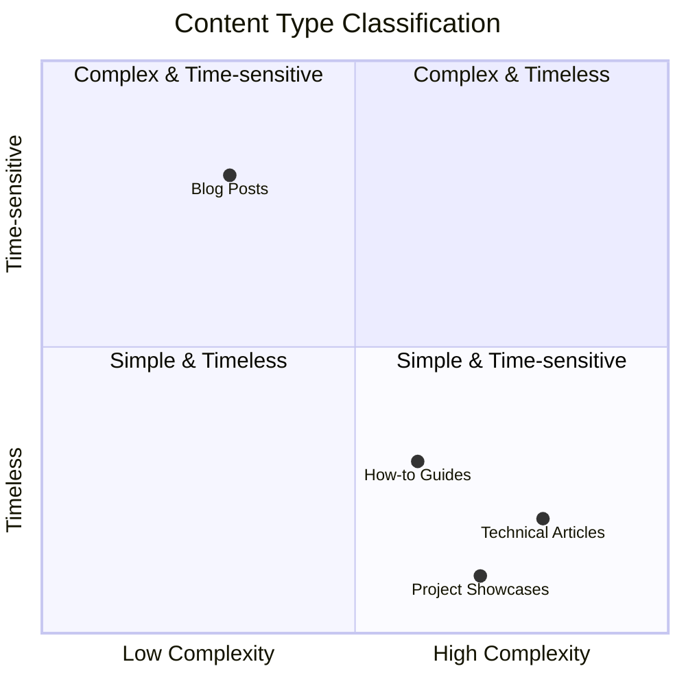

### Content Characteristics

| Type | Purpose | Structure | Audience | Update Frequency |
|------|---------|-----------|----------|------------------|
| **Blog Posts** | Personal thoughts, announcements | Chronological | General | Regular |
| **Technical Articles** | In-depth technical content | Topic-based | Technical | Occasional |
| **How-to Guides** | Step-by-step instructions | Procedural | Practical learners | As needed |
| **Project Showcases** | Portfolio items | Feature-based | Potential clients | Rare |

## File Organization

### Directory Structure

```
yourrepo/
├── _config.yml                 # Jekyll configuration
├── _layouts/
│   ├── default.html            # Base template with navigation
│   └── post.html               # Content template
├── _posts/                     # Blog posts (date-based)
│   └── YYYY-MM-DD-title.md
├── _articles/                  # Technical articles (topic-based)
│   └── topic-name.md
├── _howtos/                    # How-to guides (task-based)
│   └── action-description.md
├── assets/
│   └── css/
│       └── main.css           # Styling
├── blog/
│   └── index.html             # Blog post index
├── articles/
│   └── index.html             # Article index
├── howtos/
│   └── index.html             # How-to index
├── projects/
│   └── index.html             # Project showcase
└── index.html                 # Homepage with previews
```

### File Naming Conventions

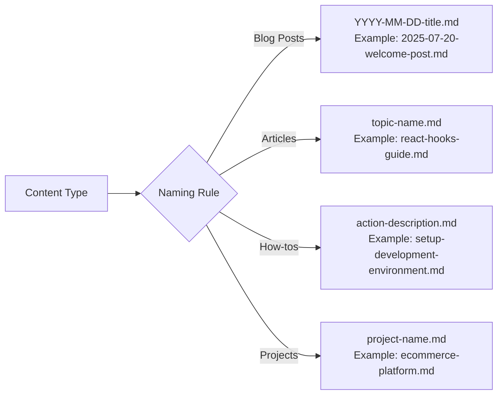

## Content Workflow

### Content Creation Process

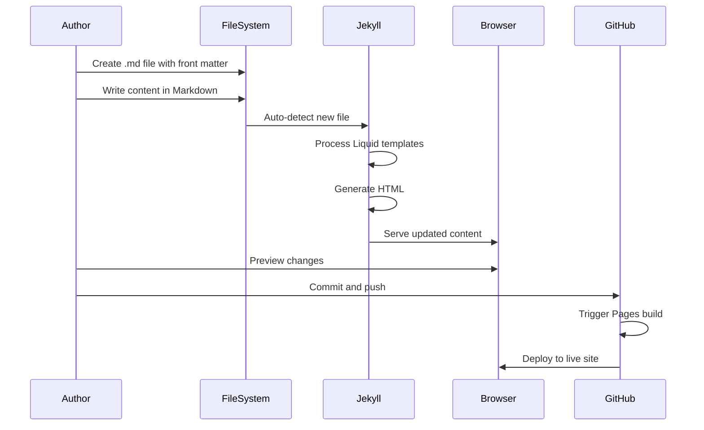

### Content Lifecycle

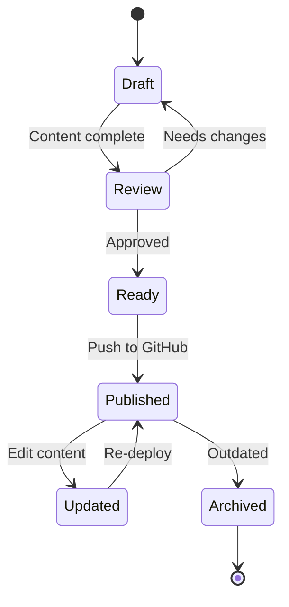

## URL Structure

### URL Mapping

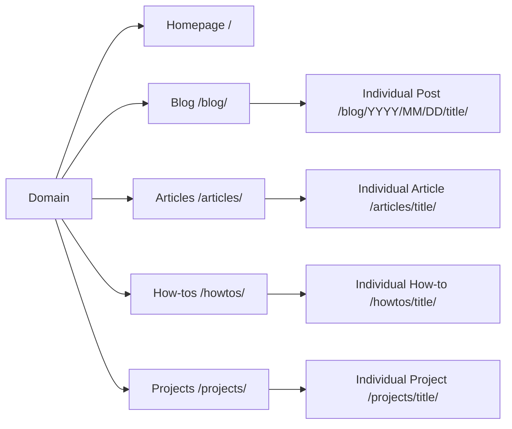

### Front Matter Schema

#### Blog Posts
```yaml
---
layout: post
title: "Post Title"
date: YYYY-MM-DD
categories: [category1, category2]
tags: [tag1, tag2, tag3]
author: "Author Name"
excerpt: "Brief description"
---
```

#### Technical Articles
```yaml
---
layout: post
title: "Article Title"
date: YYYY-MM-DD
categories: [technical, category]
tags: [tag1, tag2, tag3]
difficulty: "beginner|intermediate|advanced"
estimated_reading_time: "X minutes"
author: "Author Name"
toc: true
excerpt: "Detailed description"
---
```

#### How-to Guides
```yaml
---
layout: post
title: "How to Do Something"
date: YYYY-MM-DD
categories: [tutorial, category]
tags: [tag1, tag2, tag3]
difficulty: "beginner|intermediate|advanced"
estimated_time: "X minutes"
requirements: 
  - "Requirement 1"
  - "Requirement 2"
tools_needed:
  - "Tool 1"
  - "Tool 2"
author: "Author Name"
excerpt: "Step-by-step guide description"
---
```

## Step-by-Step Content Creation

### Creating a Blog Post

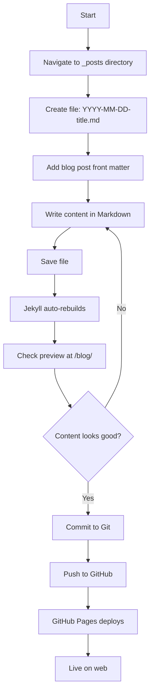

### Creating a Technical Article

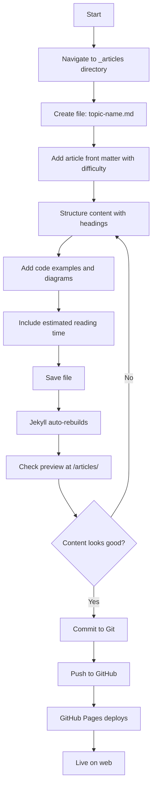

### Creating a How-to Guide

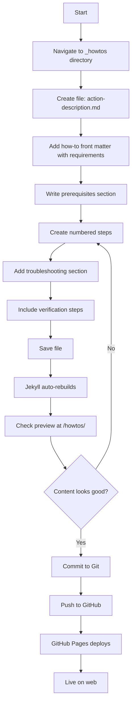

## Deployment Process

### Local Development Workflow

```mermaid
gitgraph
    commit id: "Initial setup"
    branch feature
    checkout feature
    commit id: "Create new content"
    commit id: "Preview locally"
    commit id: "Refine content"
    checkout main
    merge feature
    commit id: "Deploy to GitHub"
    commit id: "Live on GitHub Pages"
```

### GitHub Pages Build Process

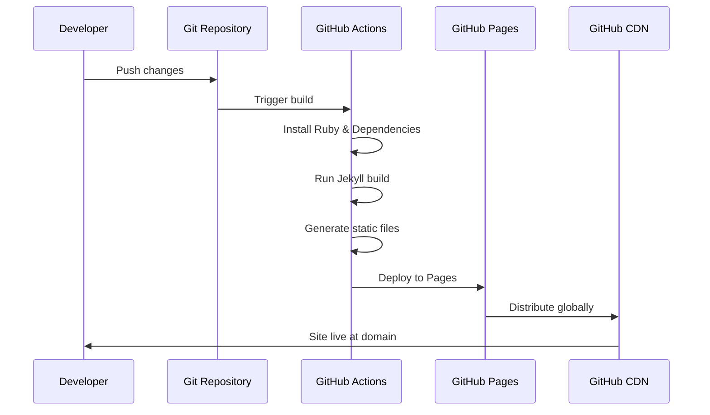

## Maintenance & Best Practices

### Content Organization Strategy

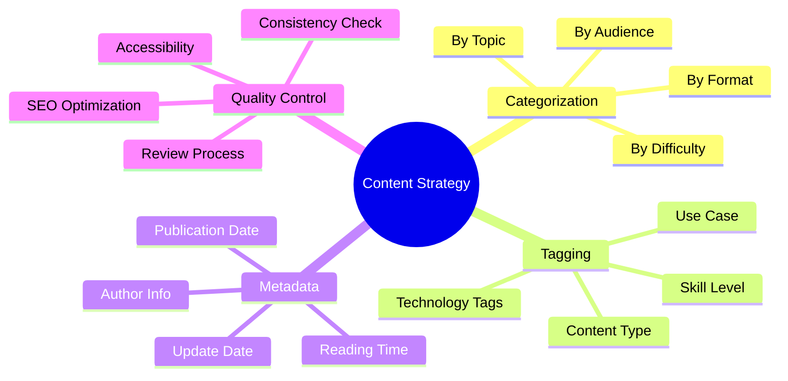

### Performance Optimization

1. **Image Optimization**
   - Compress images before adding
   - Use appropriate formats (WebP, AVIF)
   - Implement lazy loading

2. **Build Optimization**
   - Limit collection sizes
   - Use incremental builds during development
   - Optimize Liquid template loops

3. **SEO Best Practices**
   - Unique titles for each page
   - Descriptive excerpts
   - Proper heading hierarchy
   - Internal linking strategy

### Quality Checklist

Before publishing any content:

- [ ] **Front matter complete**: All required fields filled
- [ ] **Content structure**: Proper headings and organization
- [ ] **Links functional**: All internal and external links work
- [ ] **Images optimized**: Compressed and properly sized
- [ ] **Preview tested**: Content displays correctly locally
- [ ] **SEO optimized**: Title, description, and tags appropriate
- [ ] **Accessibility**: Alt text for images, proper contrast
- [ ] **Mobile responsive**: Displays well on all screen sizes

### Troubleshooting Guide

#### Common Issues

| Issue | Symptoms | Solution |
|-------|----------|----------|
| Content not appearing | File exists but not on site | Check front matter syntax |
| Build failing | Site not updating on GitHub | Check Actions tab for errors |
| Styling broken | Content displays without CSS | Verify CSS file paths |
| Links not working | 404 errors on internal links | Check permalink configuration |

#### Debug Process

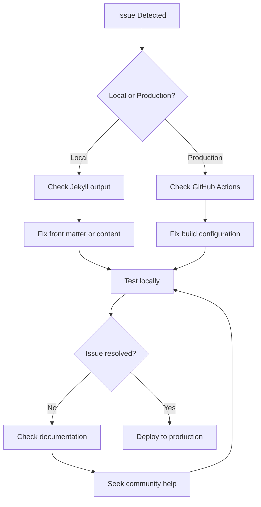

## Conclusion

This design document provides a comprehensive blueprint for managing content in the Jekyll blog system. The modular architecture allows for easy expansion while maintaining consistency and performance.

### Next Steps

1. **Implement monitoring**: Set up analytics and performance monitoring
2. **Create templates**: Develop content templates for faster creation
3. **Automate workflows**: Add GitHub Actions for content validation
4. **Enhance features**: Consider adding search, comments, or related content

### Resources

- [Jekyll Documentation](https://jekyllrb.com/docs/)
- [GitHub Pages Documentation](https://docs.github.com/en/pages)
- [Liquid Template Language](https://shopify.github.io/liquid/)
- [Mermaid Diagram Syntax](https://mermaid-js.github.io/mermaid/)

---

*This document serves as the authoritative guide for content creation and system maintenance. Keep it updated as the system evolves.*
