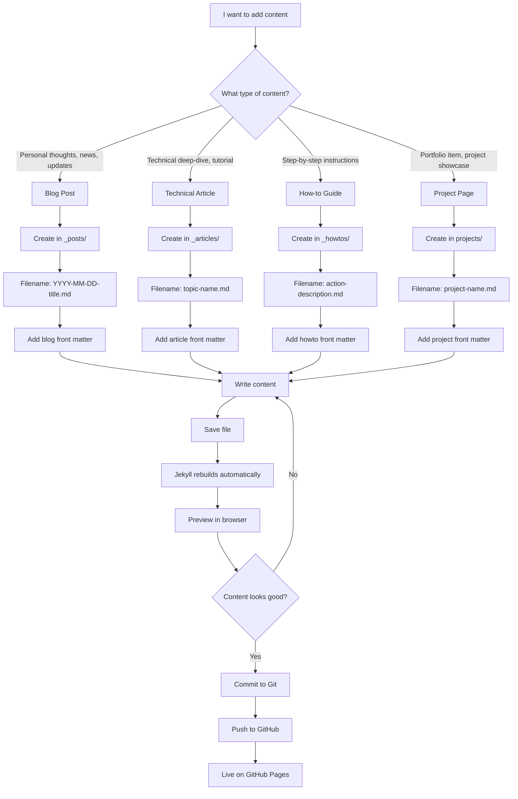
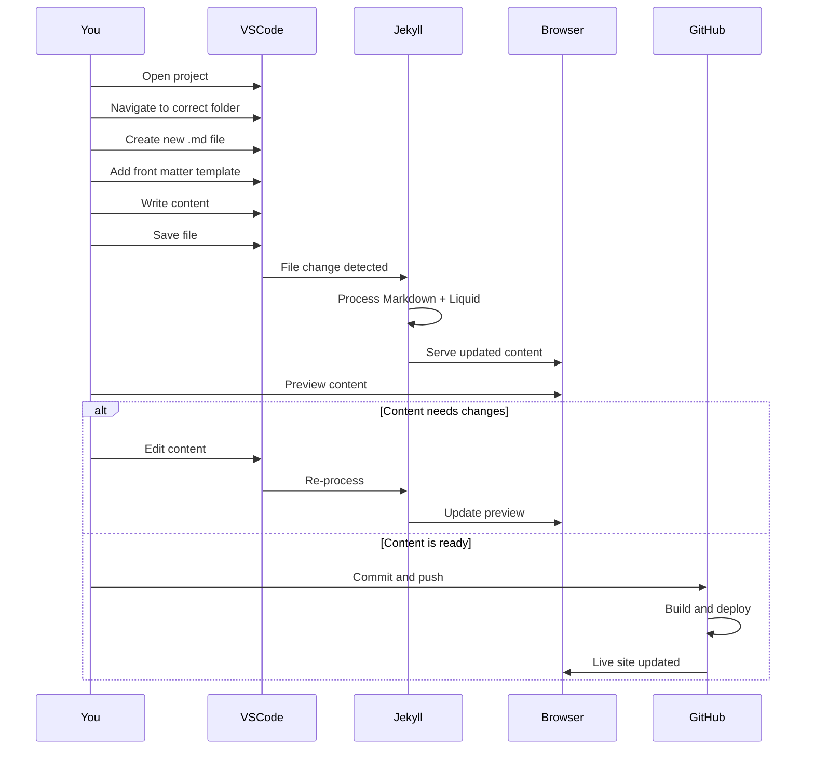
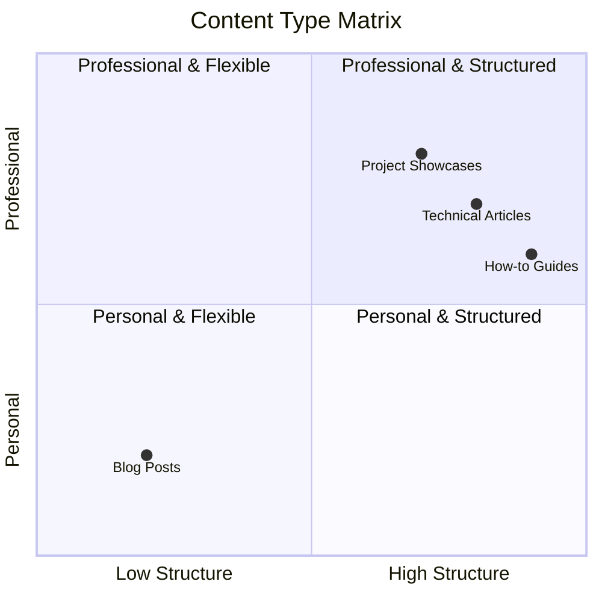
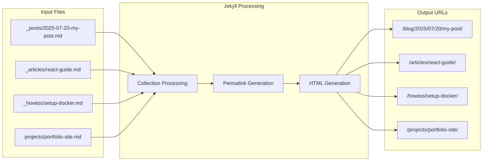
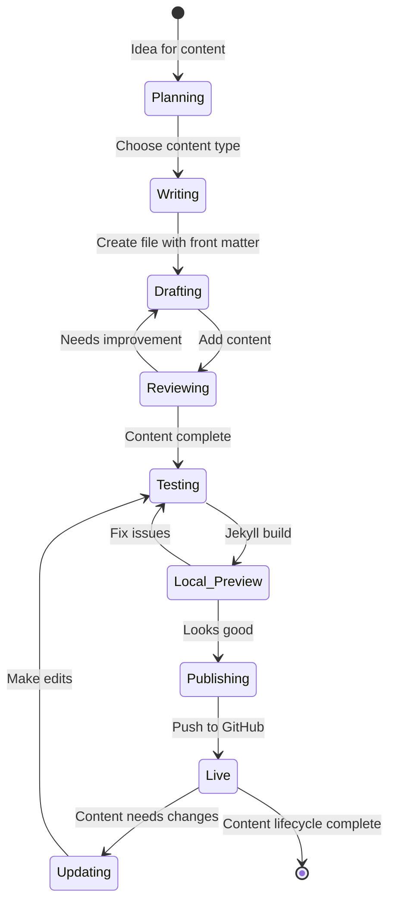
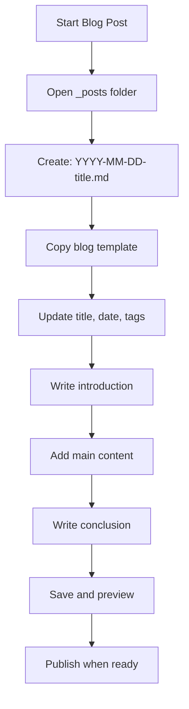
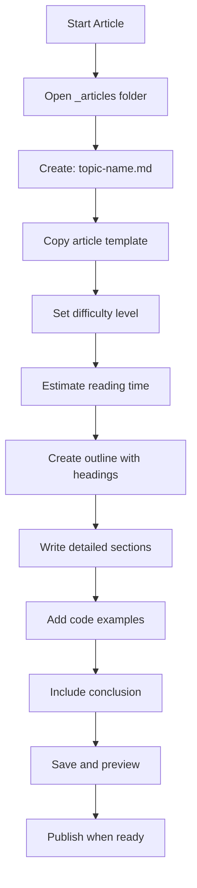
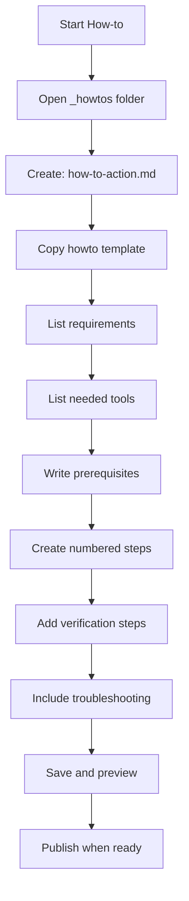
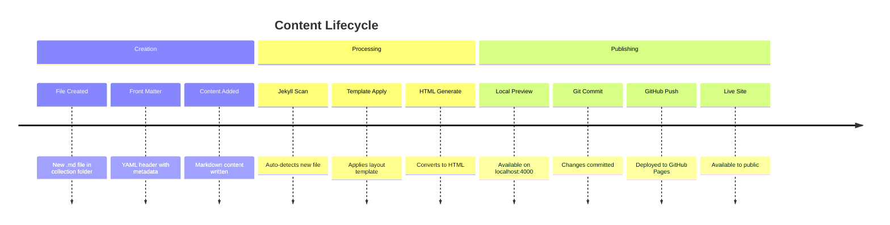
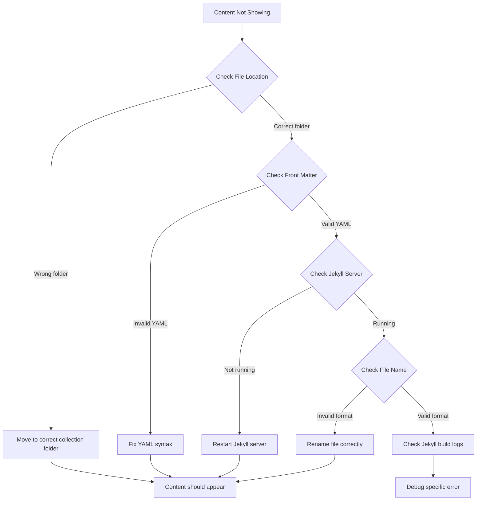

## Content Creation Decision Tree



## File Creation Process



## Content Type Comparison



## Front Matter Field Guide

```mermaid
graph TB
    subgraph "Required Fields (All Content)"
        A[layout: post]
        B[title: "Your Title"]
        C[date: YYYY-MM-DD]
        D[author: "Your Name"]
        E[excerpt: "Description"]
    end
    
    subgraph "Blog-Specific Fields"
        F[categories: blog, category]
        G[tags: tag1, tag2]
    end
    
    subgraph "Article-Specific Fields"
        H[difficulty: beginner/intermediate/advanced]
        I[estimated_reading_time: "X minutes"]
        J[toc: true]
        K[categories: technical, category]
    end
    
    subgraph "How-to Specific Fields"
        L[estimated_time: "X minutes"]
        M[requirements: list]
        N[tools_needed: list]
        O[categories: tutorial, category]
    end
    
    A --> P[All Content Types]
    B --> P
    C --> P
    D --> P
    E --> P
    
    F --> Q[Blog Posts]
    G --> Q
    
    H --> R[Technical Articles]
    I --> R
    J --> R
    K --> R
    
    L --> S[How-to Guides]
    M --> S
    N --> S
    O --> S
```

## URL Generation Flow



## Development Workflow States



## Quick Action Guide

### Starting a New Blog Post



### Starting a Technical Article



### Starting a How-to Guide



## Content Discovery Timeline



## Troubleshooting Decision Tree



This visual guide provides all the workflows and decision trees you need for effective content management in your Jekyll blog system!
