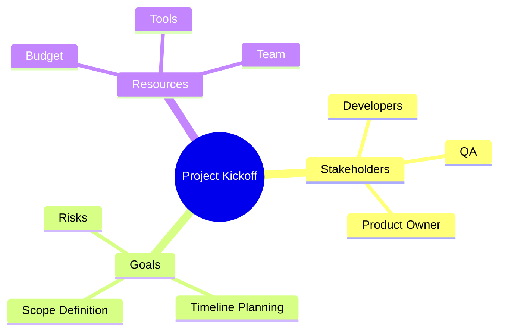
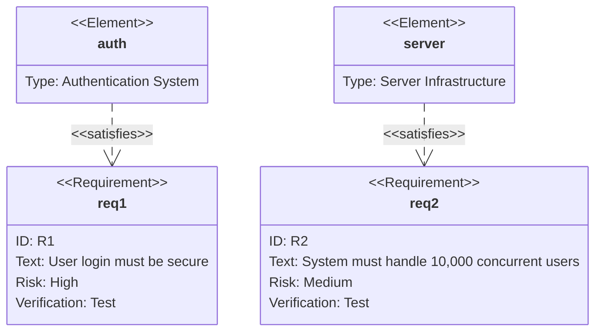
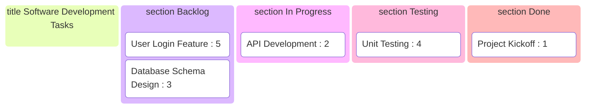
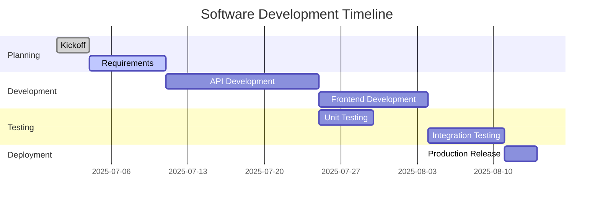
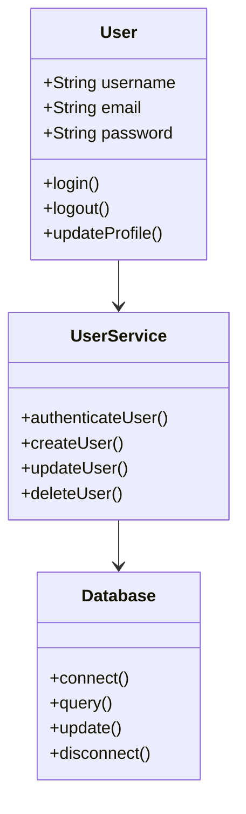
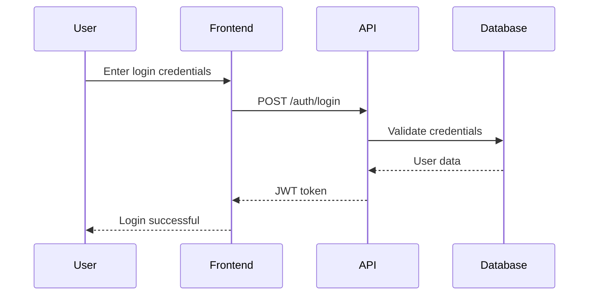
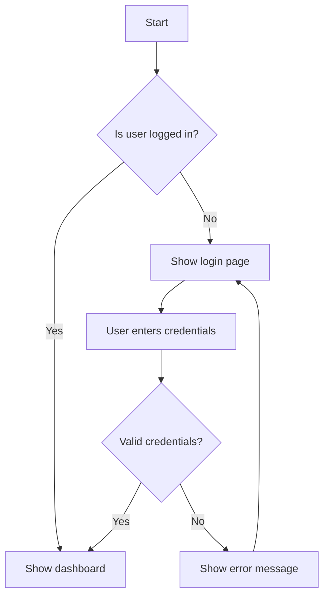
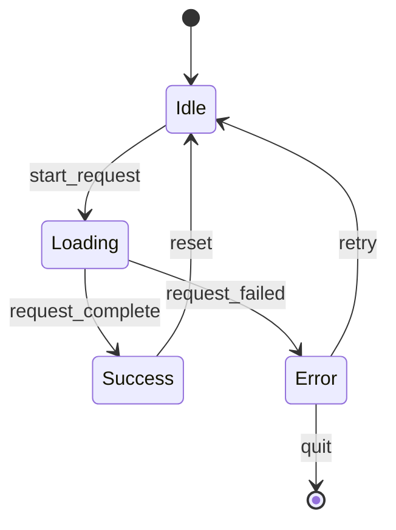

# Mermaid Diagrams for Software Design & Agile Project Management: A Comprehensive Guide

## Introduction

In today's fast-paced software development environment, clear communication and visual representation of ideas are crucial for project success. This comprehensive guide explores the powerful combination of **Mermaid diagrams** with **Microsoft Teams** and **Loop** to create an integrated agile development workflow.

Mermaid is a text-based diagramming tool that supports multiple diagram types including flowcharts, mindmaps, class diagrams, sequence diagrams, requirement diagrams, Kanban boards, and Gantt charts. When combined with Microsoft Teams and Loop, it creates a powerful ecosystem for collaborative software development.

## Why Mermaid Diagrams Matter in Software Development

Visual communication is essential in software development for several reasons:

- **Clarity**: Complex systems and processes become easier to understand
- **Documentation**: Living documentation that evolves with your code
- **Collaboration**: Universal visual language that all team members can understand
- **Version Control**: Text-based diagrams can be versioned alongside code
- **Integration**: Seamless integration with modern development tools

## Setting Up Your Development Environment

### VS Code Configuration

To work effectively with Mermaid diagrams in VS Code:

1. Install the **"Markdown Preview Mermaid Support"** extension
2. This enables real-time preview of Mermaid diagrams within markdown files
3. Allows for offline editing and validation of diagrams

### Microsoft Teams Integration

Create a comprehensive team workspace:

1. **Create a new Team** in Microsoft Teams (Private recommended)
2. **Add channels** for different aspects of development:
   - `general` – main announcements, Loop tab lives here
   - `dev-chat` – daily stand-ups & code links
   - `qa-chat` – testing feedback
   - `retro-chat` – retrospectives & voting

3. **Add a Loop tab** in the general channel
   - Select "New workspace"
   - Name it appropriately (e.g., "Phoenix-Workspace")
   - Rename the tab to "Project Hub" for clarity

## The Complete Agile Project Lifecycle with Mermaid

### Phase 1: Project Kick-off with Mindmaps

Start every project with a comprehensive mindmap to establish scope and stakeholders:

**Benefits:**

- Visualizes all project aspects at a glance
- Helps identify missing stakeholders or resources
- Creates shared understanding among team members

### Phase 2: Requirements Engineering with Requirement Diagrams

Transform business needs into structured requirements:

**Key Features:**

- Links requirements to system components
- Tracks risk levels and verification methods
- Maintains traceability throughout development

### Phase 3: Agile Task Management with Kanban Boards

Implement visual task tracking:

**Workflow Benefits:**
- Real-time visibility into task progress
- Easy identification of bottlenecks
- Promotes continuous improvement

### Phase 4: Timeline Management with Gantt Charts

Plan and track project timelines:

### Phase 5: System Architecture with Class Diagrams

Design system structure and relationships:

### Phase 6: Process Flow with Sequence Diagrams

Document system interactions and workflows:

## Implementation Guide: Loop Page Templates

### Template Structure

Create the following pages in your Loop workspace:

1. **0-Kick-off** - Project mindmap and progress tracker
2. **1-Requirements** - Requirements table and voting components
3. **2-Kanban-Board** - Live task tracking
4. **2-Timeline** - Gantt chart for planning
5. **3-Architecture** - System architecture diagrams
6. **3-Class-Design** - Class relationship diagrams
7. **3-Sequence-Flows** - Process flow documentation
8. **4-QA-Matrix** - Testing strategy and results
9. **4-Release-Notes** - Version history and changes
10. **5-Retro** - Retrospective findings and improvements

### Loop Components Integration

Each page should include:
- **Code Snippet components** with Mermaid diagrams
- **Interactive components** (Progress Trackers, Voting Tables, etc.)
- **Collaborative elements** for team input and feedback

## Project Tasks Checklist

Ensure comprehensive project setup with this checklist:

- [ ] Create Team in Microsoft Teams
- [ ] Add channels: general, dev-chat, qa-chat, retro-chat
- [ ] Add Loop tab in general channel
- [ ] Create Loop workspace pages (0–5)
- [ ] Paste Mermaid diagrams into pages
- [ ] Insert Kanban component and add cards
- [ ] Hold first stand-up using Kanban board
- [ ] Complete Requirements table and voting
- [ ] Plan timeline with Gantt
- [ ] Conduct first retro with Voting Table

## Best Practices for Mermaid Integration

### 1. Consistency in Diagram Styling
- Use consistent naming conventions
- Maintain color schemes across diagrams
- Standardize node shapes and connections

### 2. Version Control Integration
- Store Mermaid diagrams in your repository
- Include diagrams in code reviews
- Update diagrams with code changes

### 3. Team Collaboration
- Use Loop for real-time collaborative editing
- Conduct diagram reviews in Teams channels
- Maintain living documentation that evolves with the project

### 4. Tool Integration
- VS Code for offline editing and preview
- Loop for collaborative sessions
- Teams for communication and project management

## Advanced Diagram Types

### Flowcharts for Decision Trees

### State Diagrams for System Behavior

## Measuring Success

Track the effectiveness of your Mermaid integration:

### Quantitative Metrics
- Reduced time in meetings due to clearer documentation
- Faster onboarding of new team members
- Decreased miscommunication incidents
- Improved requirement traceability

### Qualitative Benefits
- Enhanced team collaboration
- Better system understanding
- Improved documentation quality
- Increased project transparency

## Conclusion

The integration of Mermaid diagrams with Microsoft Teams and Loop creates a powerful ecosystem for agile software development. This approach provides:

- **Visual clarity** in complex system design
- **Real-time collaboration** through integrated tools
- **Living documentation** that evolves with your project
- **Streamlined communication** across all team members

By following this comprehensive guide, teams can establish a robust foundation for successful software development projects that scale with complexity while maintaining clarity and collaboration.

The combination of text-based diagramming, collaborative platforms, and structured workflows creates an environment where teams can focus on building great software while maintaining clear communication and comprehensive documentation throughout the development lifecycle.

## Quick Start Summary

1. Set up VS Code with Mermaid support
2. Create Microsoft Teams workspace with appropriate channels
3. Add Loop integration for collaborative documentation
4. Implement the 10-page template structure
5. Use Mermaid diagrams for all visual communication
6. Conduct regular stand-ups using the Kanban board
7. Maintain living documentation throughout the project lifecycle

With these tools and practices in place, your team will be equipped to handle projects of any complexity while maintaining transparency, collaboration, and clear communication.
